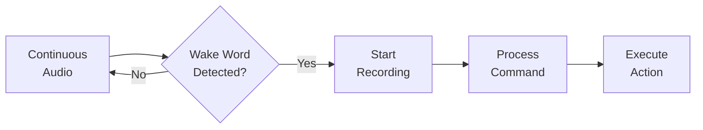
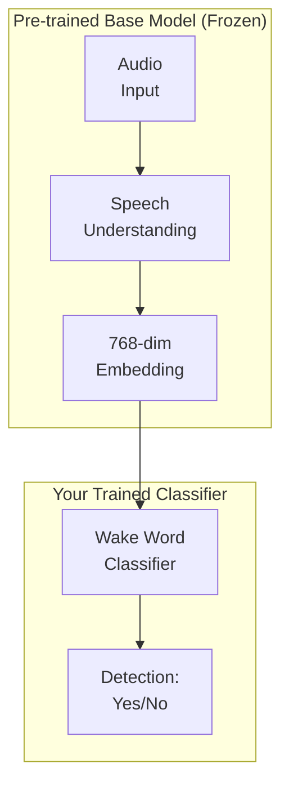

# What is a Wake Word?

Understanding wake words and how WakeBuilder helps you create them.

---

## Definition

A **wake word** (also called a "hotword" or "trigger word") is a specific phrase that activates a voice assistant or voice-controlled device. Common examples include:

- **"Hey Siri"** - Apple's voice assistant
- **"Alexa"** - Amazon's voice assistant
- **"OK Google"** - Google's voice assistant
- **"Hey Cortana"** - Microsoft's voice assistant

When you speak the wake word, the device "wakes up" and starts listening for your command.

---

## Why Wake Words Matter

### Always-On Listening

Voice assistants need to listen continuously to detect when you're talking to them. However, constantly sending audio to the cloud would be:

- **Privacy-invasive** - Your conversations would be transmitted constantly
- **Bandwidth-intensive** - Streaming audio 24/7 uses significant data
- **Energy-consuming** - Constant network activity drains batteries

### Local Detection

Wake word detection solves this by running **locally** on the device:

1. A small, efficient model listens for just the wake word
2. Only when the wake word is detected, does the device start recording
3. Only your command (not your private conversations) is processed

---

## What Makes a Good Wake Word?

### Characteristics

| Characteristic | Good | Poor |
|----------------|------|------|
| **Syllables** | 2-4 syllables | 1 syllable |
| **Uniqueness** | Uncommon phrase | Common word |
| **Pronunciation** | Easy to say consistently | Hard to pronounce |
| **Distinctiveness** | Phonetically unique | Sounds like many words |

### Examples

=== "Good Wake Words"

    - **"Phoenix"** - 2 syllables, uncommon, distinctive
    - **"Hey Computer"** - 4 syllables, clear pattern
    - **"Jarvis"** - 2 syllables, unique sound
    - **"Listen Up"** - 2 words, distinctive combination

=== "Poor Wake Words"

    - **"Hi"** - Too short, common word
    - **"Computer"** - Appears in everyday speech
    - **"The"** - Extremely common word
    - **"Supercalifragilistic"** - Too long and hard to pronounce

---

## How WakeBuilder Creates Wake Word Models

WakeBuilder uses a **transfer learning** approach to create custom wake word models:

### The Challenge

Traditional wake word training requires:

- Thousands of audio recordings
- Multiple speakers and accents
- Expensive compute resources
- Machine learning expertise

### The Solution

WakeBuilder leverages **pre-trained speech understanding**:

1. **Base Model**: The Audio Spectrogram Transformer (AST) already understands speech patterns from training on 35+ words across thousands of speakers
2. **Your Classifier**: WakeBuilder trains only a small classifier head (~230K parameters) to recognize your specific wake word
3. **Data Augmentation**: TTS engines generate diverse voice samples from your few recordings

---

## The Science Behind Detection

### Audio Processing

When you speak, sound waves are captured as a digital waveform:

1. **Raw Audio**: 16,000 samples per second at 16kHz
2. **Spectrogram**: Frequency analysis over time windows
3. **Mel Spectrogram**: Frequency bands aligned to human perception
4. **AST Embedding**: 768-dimensional representation

### Classification

The classifier outputs a probability between 0 and 1:

- **High confidence (>0.7)**: Likely the wake word → Trigger detection
- **Low confidence (<0.3)**: Not the wake word → Continue listening
- **Medium confidence (0.3-0.7)**: Uncertain → Threshold determines action

---

## Applications

Wake words enable many use cases:

### Consumer Electronics

- Smart speakers and displays
- Smartphones and tablets
- Wearable devices
- Smart home appliances

### Industrial Applications

- Hands-free machine control
- Safety systems
- Accessibility devices
- Automotive voice control

### Custom Applications

With WakeBuilder, you can create wake words for:

- Personal voice assistants
- Smart home automation
- Gaming voice commands
- Accessibility tools
- Custom IoT devices

---

## Accessibility & Speech Differences

One of WakeBuilder's most important features is its accessibility for users with unique speech patterns:

### Why This Matters

Many commercial wake word systems are trained on "standard" speech patterns. This can be frustrating for users with:

- **Speech disabilities** - Natural speech variations
- **Accents** - Regional or non-native pronunciation
- **Health conditions** - Conditions affecting speech
- **Age-related changes** - Voice changes over time

### How WakeBuilder Helps

WakeBuilder lets you train a model specifically for **your voice**:

1. **Record 1-5 samples** of yourself saying the wake word
2. The model learns **your specific pronunciation**
3. Detection is tuned to **recognize you**

This means the model adapts to you—not the other way around.

!!! success "Personalized Recognition"
    Unlike commercial systems trained on millions of "typical" voices,
    your WakeBuilder model is trained specifically on **your voice**
    and your pronunciation, making it uniquely suited to recognize you.

---

## Privacy Considerations

WakeBuilder prioritizes your privacy:

| Aspect | WakeBuilder | Cloud Services |
|--------|-------------|----------------|
| **Training** | 100% local | Cloud processing |
| **Your Voice Data** | Never leaves your machine | Uploaded to servers |
| **Model Storage** | On your device | Cloud-hosted |
| **Detection** | Runs locally | May phone home |
| **Subscriptions** | None | Often required |

Your voice recordings are used only for training and are automatically deleted afterward.

---

## Next Steps

Ready to create your own wake word?

[:material-rocket-launch: Quick Start Guide](quick-start.md){ .md-button .md-button--primary }
