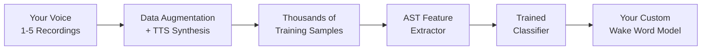

# WakeBuilder Documentation

  <h2>🎙️ Create Custom Wake Words Locally</h2>
  
<em>No cloud. No API credits. No subscriptions. No ML expertise required.</em>

---

## What is WakeBuilder?

**WakeBuilder** is a comprehensive training platform that enables you to create custom wake word detection models entirely on your local machine. Whether you want to build a personal voice assistant that responds to "Phoenix," create a smart home automation triggered by "Hey Computer," or develop a unique voice interface for your application, WakeBuilder makes it possible—without sending your voice data to the cloud.

- :lock:{ .lg .middle } **100% Local & Private**

    ---

    All training happens on your machine. Your voice data never leaves your device, ensuring complete privacy and data ownership.

- :material-human-greeting:{ .lg .middle } **Accessible Voice Training**

    ---

    Perfect for users with unique speech patterns or pronunciation differences due to health conditions—train a model that recognizes **your** voice specifically.

- :sparkles:{ .lg .middle } **Few-Shot Learning**

    ---

    Train effective models with just 1-5 voice recordings. TTS engines generate diverse variations automatically.

- :art:{ .lg .middle } **Sophisticated Augmentation**

    ---

    Automatic generation of thousands of training variations using multiple TTS engines and audio effects.

---

## How It Works

WakeBuilder uses a powerful **transfer learning** approach based on the **Audio Spectrogram Transformer (AST)**:

1. **Record** - Speak your wake word 1-5 times into your microphone
2. **Augment** - WakeBuilder generates thousands of variations using multiple TTS voices
3. **Train** - A classifier learns to recognize your specific wake word
4. **Test** - Validate your model with real-time testing
5. **Deploy** - Export and use your model with WakeEngine

---

## Quick Links

- :material-clock-fast:{ .lg .middle } **Getting Started**

    ---

    Install WakeBuilder and start training your first wake word model.

    [:octicons-arrow-right-24: Quick Start](getting-started/quick-start.md)

- :material-cog:{ .lg .middle } **Configuration**

    ---

    Fine-tune training parameters, audio settings, and model architecture options.

    [:octicons-arrow-right-24: Configuration Guide](configuration/index.md)

- :material-code-braces:{ .lg .middle } **Technical Deep Dive**

    ---

    Understand the AST architecture, training pipeline, and data generation process.

    [:octicons-arrow-right-24: Technical Guide](technical/index.md)

- :material-api:{ .lg .middle } **API Reference**

    ---

    Explore the FastAPI endpoints for programmatic access to training and testing.

    [:octicons-arrow-right-24: API Documentation](reference/api-endpoints.md)

---

## Key Features

### 🎯 Transfer Learning with AST

WakeBuilder uses the pre-trained **MIT/ast-finetuned-speech-commands-v2** model as a frozen feature extractor. This 87-million parameter model already understands speech patterns from training on diverse audio datasets. You only train a small classifier head (~230K parameters), enabling effective learning from minimal examples.

### 🔊 Multi-TTS Data Augmentation

Generate diverse training data using multiple Text-to-Speech engines:

| TTS Provider | Voices | Characteristics |
|--------------|--------|-----------------|
| **Piper TTS** | ~87 | High-quality offline voices |
| **Edge TTS** | ~302 | Microsoft neural voices |
| **Kokoro TTS** | ~40+ | American & British accents |
| **Coqui TTS** | ~10 | Multi-speaker models |

### 🛡️ Hard Negative Generation

WakeBuilder automatically generates phonetically similar words (like "jarv" for "jarvis") to train your model to reject near-matches, dramatically reducing false positives.

### ♿ Accessibility-Focused

WakeBuilder is especially valuable for users with unique speech patterns or pronunciation differences:

- **Speech disabilities** - Train a model tuned to your specific voice
- **Accents** - Create models that understand your natural pronunciation
- **Health conditions** - Works with 1-5 recordings of however you speak

### 🌐 Beautiful Web Interface

A modern, intuitive web interface guides you through the entire process:

- **Model Dashboard** - View, test, and manage all your wake word models
- **Training Wizard** - Step-by-step guidance for creating new models
- **Real-time Testing** - Test models with live audio from your microphone
- **Training Metrics** - Monitor progress with live charts and statistics

---

## System Requirements

!!! warning "GPU Strongly Recommended"
    While WakeBuilder can run on CPU, training without a GPU can be **extremely slow** (potentially hours). A CUDA-compatible GPU is strongly recommended for practical training times.

| Resource | Minimum | Recommended |
|----------|---------|-------------|
| **RAM** | 8GB free | 16GB+ free |
| **GPU VRAM** | 6GB NVIDIA | 8GB+ NVIDIA |
| **Storage** | 10GB free | 20GB+ free |
| **CPU** | Multi-core | 8+ cores |
| **Python** | 3.12+ | 3.12+ |

### Training Time Expectations

Training time varies significantly based on your hardware:

| Hardware | Approximate Training Time |
|----------|---------------------------|
| High-end GPU (RTX 3080+) | 30 minutes - 1.5 hours |
| Mid-range GPU (RTX 3060) | 1 - 2 hours |
| Entry GPU (GTX 1650) | 2 - 4 hours |
| CPU only | **4+ hours** (not recommended) |

---

## Why Local Training Matters

- **No API credits** - Train unlimited models at no cost
- **No cloud dependency** - Works completely offline (except Edge TTS)
- **Complete privacy** - Your voice never leaves your machine
- **Full ownership** - You own your trained models completely

---

## License

WakeBuilder is released under the **Apache License 2.0**, allowing both personal and commercial use. See the [full license](about/license.md) for details.

---

  <strong>Made with ❤️ by Sami RAJICHI</strong>
   
  <em>Making wake word technology accessible to everyone.</em>

