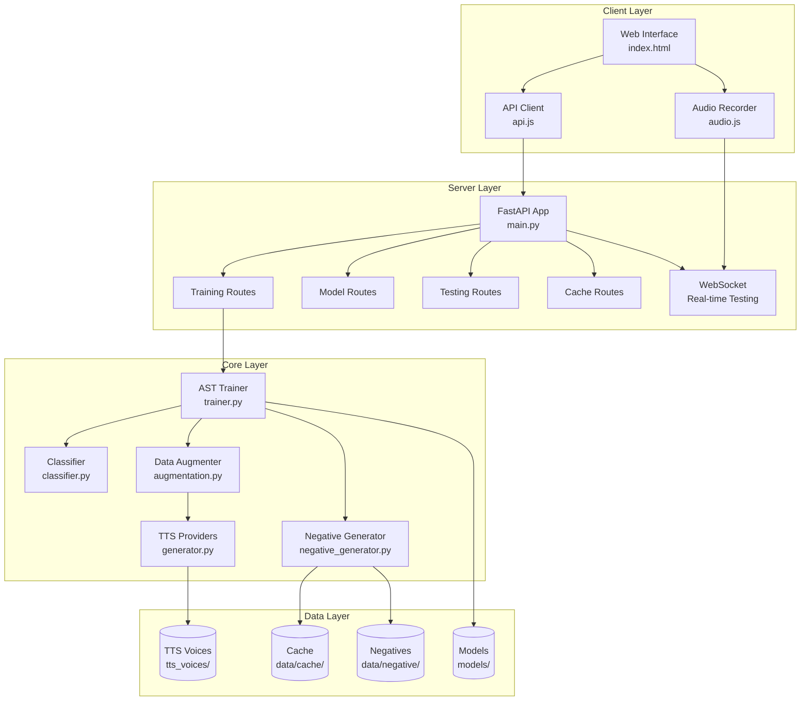
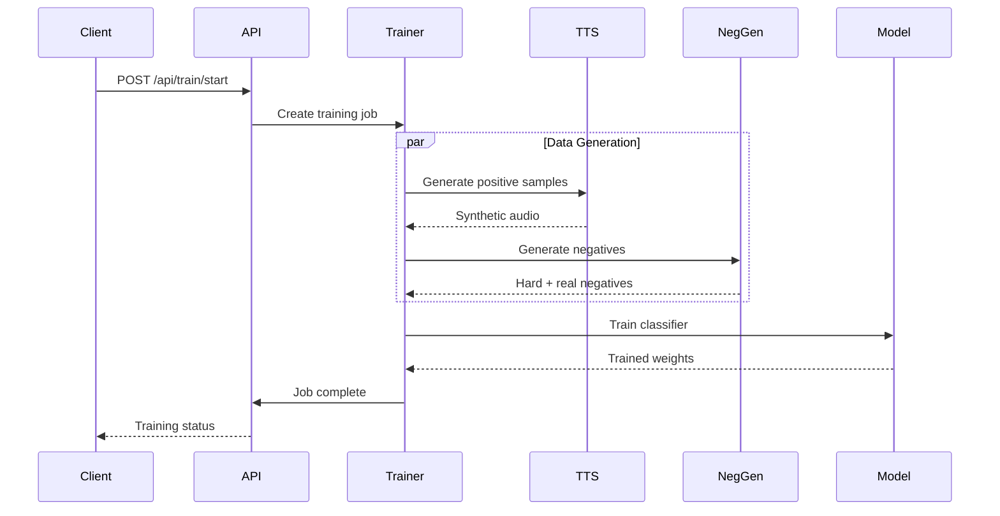
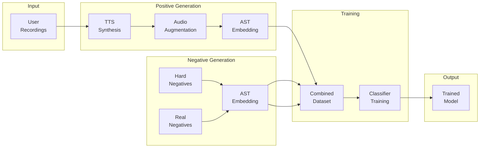
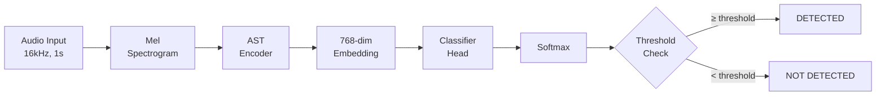
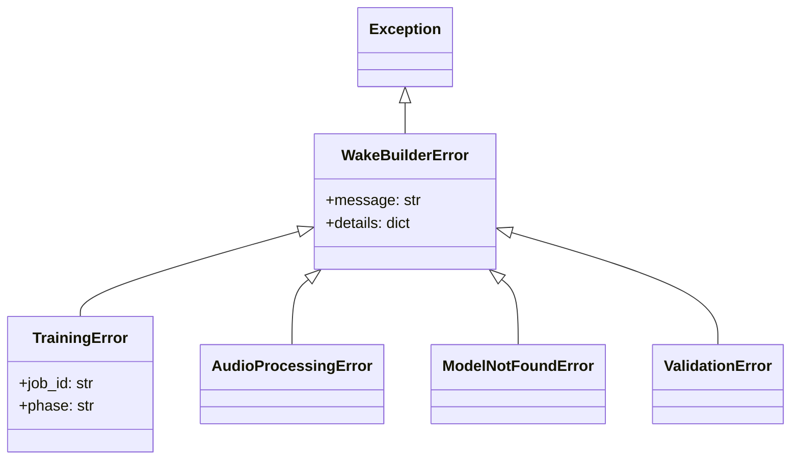

# Architecture Overview

Comprehensive system architecture documentation for WakeBuilder.

---

## High-Level Architecture

WakeBuilder is built on a modular three-layer architecture:



---

## Component Details

### Presentation Layer

#### Web Frontend

| File | Purpose |
|------|---------|
| `frontend/index.html` | Single-page application |
| `frontend/css/styles.css` | Styling and layout |
| `frontend/js/app.js` | Main application logic |
| `frontend/js/api.js` | API communication |
| `frontend/js/audio.js` | Audio recording |
| `frontend/js/trainer.js` | Training workflow |
| `frontend/js/tester.js` | Model testing |
| `frontend/js/charts.js` | Training visualizations |

#### FastAPI Backend

| File | Purpose |
|------|---------|
| `backend/main.py` | Application entry point |
| `backend/jobs.py` | Training job management |
| `backend/schemas.py` | Pydantic data models |
| `backend/routes/training.py` | Training endpoints |
| `backend/routes/models.py` | Model management endpoints |
| `backend/routes/testing.py` | Testing endpoints |
| `backend/routes/cache.py` | Cache management endpoints |

---

### Business Logic Layer

#### Training Pipeline



#### Key Classes

| Class | Location | Responsibility |
|-------|----------|----------------|
| `ASTTrainer` | `models/trainer.py` | Training orchestration |
| `ASTWakeWordModel` | `models/classifier.py` | Complete model architecture |
| `WakeWordClassifier` | `models/classifier.py` | Classifier head |
| `DataAugmenter` | `audio/augmentation.py` | Audio augmentation |
| `NegativeExampleGenerator` | `audio/negative_generator.py` | Hard negative generation |
| `TTSGenerator` | `tts/generator.py` | Piper TTS wrapper |
| `EdgeTTSGenerator` | `tts/edge_generator.py` | Edge TTS wrapper |
| `KokoroTTSGenerator` | `tts/kokoro_generator.py` | Kokoro TTS wrapper |
| `CoquiTTSGenerator` | `tts/coqui_generator.py` | Coqui TTS wrapper |

---

### Data Layer

#### Directory Structure

```
WakeBuilder/
├── models/
│   ├── default/          # Pre-trained default models
│   └── custom/           # User-trained models
│       └── jarvis/       # Model for "jarvis"
│           ├── jarvis.pt
│           ├── jarvis.json
│           └── jarvis.onnx
├── data/
│   ├── negative/         # UNAC negative audio corpus
│   │   ├── music/
│   │   ├── speech/
│   │   └── ambient/
│   └── cache/
│       └── negative_chunks/  # Pre-processed chunks
├── tts_voices/           # Piper TTS voice models
│   ├── en_US-amy-*.onnx
│   ├── en_US-arctic-*.onnx
│   └── ...
├── recordings/           # Temporary user recordings
└── frontend/             # Web interface files
```

---

## Data Flow

### Training Data Flow



### Inference Data Flow



---

## API Architecture

### RESTful Endpoints

| Endpoint | Method | Purpose |
|----------|--------|---------|
| `/api/train/start` | POST | Start training job |
| `/api/train/status/{job_id}` | GET | Get training status |
| `/api/train/download/{job_id}` | GET | Download trained model |
| `/api/models` | GET | List all models |
| `/api/models/{model_id}` | GET | Get model details |
| `/api/models/{model_id}` | DELETE | Delete model |
| `/api/test/file` | POST | Test with audio file |
| `/api/test/ws` | WebSocket | Real-time testing |
| `/api/cache/info` | GET | Cache status |
| `/api/cache/build` | POST | Build negative cache |

### WebSocket Protocol

Real-time testing uses WebSocket for bidirectional audio streaming:

```json
// Client → Server: Audio chunk
{
  "type": "audio",
  "data": "<base64 encoded audio>",
  "sample_rate": 16000
}

// Server → Client: Detection result
{
  "type": "detection",
  "detected": true,
  "confidence": 0.87,
  "timestamp": "2026-01-06T15:30:00Z"
}
```

---

## Configuration Management

### Centralized Configuration

All settings are managed in `src/wakebuilder/config.py`:

```python
# Audio processing
AUDIO_CONFIG = {
    "sample_rate": 16000,
    "n_mels": 80,
    "n_fft": 512,
    "duration": 1.0,
}

# Training parameters
TRAINING_CONFIG = {
    "embedding_dim": 768,
    "hidden_dims": [256, 128],
    "dropout_rate": 0.3,
    "learning_rate": 0.001,
    "batch_size": 32,
}

# AST model
AST_CONFIG = {
    "model_checkpoint": "MIT/ast-finetuned-speech-commands-v2",
    "embedding_dim": 768,
    "freeze_base": True,
}
```

### Environment Variables

Override defaults with environment variables:

| Variable | Default | Description |
|----------|---------|-------------|
| `WAKEBUILDER_HOST` | `0.0.0.0` | Server host |
| `WAKEBUILDER_PORT` | `8000` | Server port |
| `CUDA_VISIBLE_DEVICES` | all | GPU selection |

---

## Error Handling

### Exception Hierarchy



### API Error Responses

```json
{
  "error": "validation_error",
  "message": "Wake word must be 4-12 characters",
  "details": {
    "field": "wake_word",
    "value": "hi",
    "constraint": "min_length=4"
  }
}
```

---

## Security Considerations

### Privacy

- All processing is local - no data leaves the machine
- User recordings are deleted after training
- No telemetry or analytics

### Input Validation

- Audio files validated for format and duration
- Wake word text sanitized
- File paths restricted to project directories

### CORS Configuration

```python
app.add_middleware(
    CORSMiddleware,
    allow_origins=["*"],  # Restrict in production
    allow_methods=["*"],
    allow_headers=["*"],
)
```

---

## Performance Characteristics

### Memory Usage

| Operation | Peak Memory |
|-----------|-------------|
| Data generation | ~4GB |
| AST inference | ~2GB |
| Classifier training | ~1GB |
| Total training | ~6-8GB |
