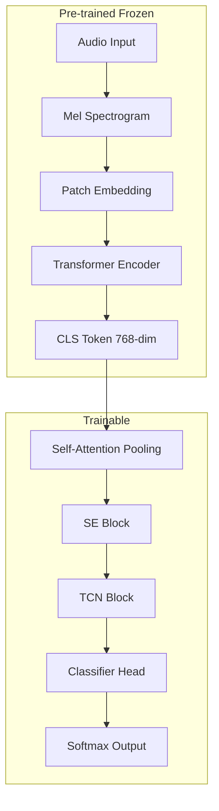
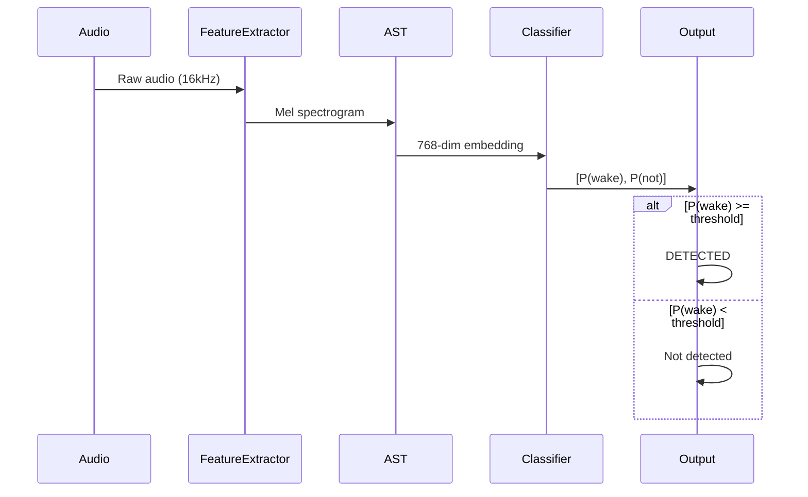

# AST Model Architecture

Deep dive into the Audio Spectrogram Transformer architecture used in WakeBuilder.

---

## Overview

WakeBuilder uses **transfer learning** with the Audio Spectrogram Transformer (AST) as the base model. The AST is pre-trained on large audio datasets and provides powerful audio understanding capabilities.



---

## Base Model: Audio Spectrogram Transformer

### Model Checkpoint

WakeBuilder uses:

```
MIT/ast-finetuned-speech-commands-v2
```

This model was:

- Pre-trained on AudioSet (2M+ audio clips)
- Fine-tuned on Speech Commands V2 (35 word classes)
- Hosted on Hugging Face

### Architecture Details

| Component | Details |
|-----------|---------|
| **Input** | 128 mel bands × 1024 time frames |
| **Patch Size** | 16 × 16 |
| **Num Patches** | ~512 patches |
| **Embedding Dim** | 768 |
| **Transformer Layers** | 12 |
| **Attention Heads** | 12 |
| **Total Parameters** | ~87 million |

### Why AST?

1. **Pre-trained knowledge**: Already understands speech patterns
2. **Transfer learning**: Only train a small classifier
3. **Diverse training**: Seen millions of audio samples
4. **Robust features**: Generalizes across speakers and accents

Reference: `src/wakebuilder/models/classifier.py` → `AST_MODEL_CHECKPOINT`

---

## Classifier Head

The trainable classifier sits on top of the frozen AST embeddings.

### Architecture

```
Input: 768-dimensional AST embedding

+-----------------------------------------+
|              LayerNorm(768)             |
+-----------------------------------------+
                    |
                    v
+-----------------------------------------+
|   Self-Attention Pooling (optional)     |
|   MultiheadAttention(768, 4 heads)      |
|   + LayerNorm                           |
+-----------------------------------------+
                    |
                    v
+-----------------------------------------+
|     Squeeze-Excitation (optional)       |
|     FC(768, 192) -> ReLU -> FC(192,768) |
|     -> Sigmoid -> Scale                 |
+-----------------------------------------+
                    |
                    v
+-----------------------------------------+
|         TCN Block (optional)            |
|     Conv1d + GroupNorm + GELU           |
|     + Residual connection               |
+-----------------------------------------+
                    |
                    v
+-----------------------------------------+
|   Linear(768, 256) + BatchNorm + GELU   |
|   Dropout(0.5)                          |
|   Linear(256, 128) + BatchNorm + GELU   |
|   Dropout(0.5)                          |
|   Linear(128, 2)                        |
+-----------------------------------------+
                    |
                    v
Output: [P(wake_word), P(not_wake_word)]
```

### Parameter Count

| Component | Parameters |
|-----------|------------|
| LayerNorm | 1,536 |
| Self-Attention | ~2.4M |
| SE Block | ~150K |
| TCN Block | ~1.2M |
| Classifier MLP | ~230K |
| **Total (with all options)** | **~4M** |
| **Total (basic)** | **~231K** |

Reference: `src/wakebuilder/models/classifier.py` → `WakeWordClassifier`

---

## Self-Attention Pooling

### Purpose

Allows the model to focus on the most discriminative parts of the AST embedding rather than treating all dimensions equally.

### Implementation

```python
class SelfAttentionPooling(nn.Module):
    def __init__(self, embedding_dim: int, num_heads: int = 4):
        self.attention = nn.MultiheadAttention(
            embed_dim=embedding_dim,
            num_heads=num_heads,
            dropout=0.1,
            batch_first=True
        )
        self.norm = nn.LayerNorm(embedding_dim)
    
    def forward(self, x):
        # x: (batch, embedding_dim)
        x = x.unsqueeze(1)  # (batch, 1, embedding_dim)
        attended, _ = self.attention(x, x, x)
        return self.norm(x + attended).squeeze(1)
```

### When to Use

- **Enable**: For complex wake words or when high discrimination is needed
- **Disable**: To reduce memory usage or training time

---

## Squeeze-Excitation Block

### Purpose

Learns channel-wise attention to emphasize important features and suppress less useful ones.

### Implementation

```python
class SqueezeExcitation(nn.Module):
    def __init__(self, dim: int, reduction: int = 4):
        reduced_dim = dim // reduction
        self.fc = nn.Sequential(
            nn.Linear(dim, reduced_dim),
            nn.ReLU(inplace=True),
            nn.Linear(reduced_dim, dim),
            nn.Sigmoid()
        )
    
    def forward(self, x):
        # x: (batch, dim)
        scale = self.fc(x)  # Channel weights
        return x * scale    # Recalibrate features
```

### When to Use

- **Enable**: For fine-grained discrimination between similar sounds
- **Disable**: When training is unstable

---

## Temporal Convolutional Network (TCN) Block

### Purpose

Captures local temporal patterns that attention might miss, using 1D convolutions.

### Implementation

```python
class TemporalConvBlock(nn.Module):
    def __init__(self, dim: int, kernel_size: int = 3, dilation: int = 1):
        self.conv = nn.Sequential(
            nn.Conv1d(dim, dim, kernel_size, padding, dilation),
            nn.GroupNorm(1, dim),
        )
        self.activation = nn.GELU()
        self.dropout = nn.Dropout(0.1)
    
    def forward(self, x):
        # x: (batch, dim)
        x = x.unsqueeze(-1)  # (batch, dim, 1)
        residual = x
        x = self.conv(x)
        x = self.activation(x)
        x = self.dropout(x)
        return (x + residual).squeeze(-1)
```

### When to Use

- **Enable**: For patterns that depend on local feature correlations
- **Disable**: To speed up training

---

## Complete Model Class

### ASTWakeWordModel

```python
class ASTWakeWordModel(nn.Module):
    def __init__(
        self,
        freeze_base: bool = True,
        classifier_hidden_dims: list[int] = [256, 128],
        classifier_dropout: float = 0.3,
        use_attention: bool = False,
        use_se_block: bool = False,
        use_tcn: bool = False,
    ):
        # Load pre-trained AST
        self.base_model = ASTModel.from_pretrained(
            "MIT/ast-finetuned-speech-commands-v2"
        )
        
        # Freeze base model
        if freeze_base:
            for param in self.base_model.parameters():
                param.requires_grad = False
        
        # Create classifier head
        self.classifier = WakeWordClassifier(
            embedding_dim=768,
            hidden_dims=classifier_hidden_dims,
            dropout=classifier_dropout,
            use_attention=use_attention,
            use_se_block=use_se_block,
            use_tcn=use_tcn,
        )
    
    def get_embeddings(self, input_values):
        outputs = self.base_model(input_values)
        # Mean pooling over sequence
        return outputs.last_hidden_state.mean(dim=1)
    
    def forward(self, input_values):
        embeddings = self.get_embeddings(input_values)
        return self.classifier(embeddings)
```

Reference: `src/wakebuilder/models/classifier.py` → `ASTWakeWordModel`

---

## Feature Extraction

### Input Processing

Audio is processed through the AST feature extractor:

```python
from transformers import AutoFeatureExtractor

feature_extractor = AutoFeatureExtractor.from_pretrained(
    "MIT/ast-finetuned-speech-commands-v2"
)

# Process audio
inputs = feature_extractor(
    audio,
    sampling_rate=16000,
    return_tensors="pt"
)
# inputs["input_values"]: (batch, max_len, 128)
```

### Spectrogram Parameters

| Parameter | Value | Description |
|-----------|-------|-------------|
| Sample rate | 16,000 Hz | Audio sample rate |
| Mel bins | 128 | Frequency resolution |
| Max length | 1,024 | Time frames (~10s) |
| Normalization | Mean/std | Per-sample normalization |

---

## Model Saving and Loading

### Save Format

Models are saved in two formats:

1. **PyTorch (.pt)**: Full model weights
2. **ONNX (.onnx)**: For deployment

### Save Function

```python
def save_wake_word_model(
    model: ASTWakeWordModel,
    wake_word: str,
    output_dir: Path,
    metadata: dict
) -> Path:
    # Save PyTorch model
    torch.save({
        'classifier_state_dict': model.classifier.state_dict(),
        'config': model.classifier.config,
    }, output_dir / f"{wake_word}.pt")
    
    # Save metadata
    with open(output_dir / f"{wake_word}.json", 'w') as f:
        json.dump(metadata, f, indent=2)
    
    return output_dir
```

Reference: `src/wakebuilder/models/classifier.py` → `save_wake_word_model()`

### Load Function

```python
def load_wake_word_model(model_path: Path) -> Tuple[ASTWakeWordModel, dict]:
    # Load checkpoint
    checkpoint = torch.load(model_path)
    
    # Reconstruct model
    model = ASTWakeWordModel(**checkpoint['config'])
    model.classifier.load_state_dict(checkpoint['classifier_state_dict'])
    
    # Load metadata
    metadata = json.load(open(model_path.with_suffix('.json')))
    
    return model, metadata
```

---

## Inference Pipeline

### Runtime Inference



### Performance

| Metric | CPU | GPU |
|--------|-----|-----|
| Feature extraction | ~50ms | ~10ms |
| AST forward pass | ~100ms | ~15ms |
| Classifier forward | ~5ms | ~1ms |
| **Total inference** | **~155ms** | **~26ms** |

---

## Why Transfer Learning Works

### The Key Insight

The AST base model has already learned:

- What speech sounds like
- How to distinguish different phonemes
- Speaker-invariant features
- Acoustic robustness

We only need to teach it:

- Which specific pattern is YOUR wake word
- What patterns should NOT trigger

### Analogy

It's like teaching a multilingual speaker to recognize a new word:

- They already understand language structure
- They can distinguish sounds
- They just need examples of the specific word
