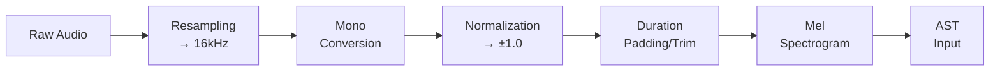

# Audio Processing Pipeline

How WakeBuilder processes audio for training and inference.

---

## Overview

The audio processing pipeline transforms raw audio into features suitable for the AST model:



---

## Input Processing

### Loading Audio

Audio files are loaded using librosa:

```python
# Supported formats: WAV, MP3, FLAC, OGG
audio, sr = librosa.load(file_path, sr=16000, mono=True)
```

### Resampling

All audio is resampled to 16kHz:

| Original SR | Resampling |
|-------------|------------|
| 44.1 kHz | Downsample to 16 kHz |
| 22.05 kHz | Downsample to 16 kHz |
| 16 kHz | No change |
| 8 kHz | Upsample to 16 kHz |

### Normalization

Audio is normalized to [-1, 1]:

```python
def normalize_audio(audio: np.ndarray) -> np.ndarray:
    max_val = np.max(np.abs(audio))
    if max_val > 0:
        audio = audio / max_val
    return audio
```

### Duration Handling

Audio is padded or trimmed to ~1 second (16,000 samples):

| Original | Action |
|----------|--------|
| < 1s | Zero-pad to 1s |
| 1s | No change |
| > 1s | Trim to 1s |

---

## Feature Extraction

### Mel Spectrogram

The AST model expects mel spectrograms:

| Parameter | Value |
|-----------|-------|
| **Sample rate** | 16,000 Hz |
| **FFT size** | 400 |
| **Hop length** | 160 |
| **Mel bins** | 128 |
| **Frequency range** | 0 - 8000 Hz |

### AST Feature Extractor

The Hugging Face feature extractor handles all preprocessing:

```python
from transformers import AutoFeatureExtractor

extractor = AutoFeatureExtractor.from_pretrained(
    "MIT/ast-finetuned-speech-commands-v2"
)

inputs = extractor(
    audio,
    sampling_rate=16000,
    return_tensors="pt"
)
# Shape: [1, 1024, 128]
```

---

## Data Augmentation

### Speed Variation

```python
def apply_speed_change(audio, sr, speed_factor):
    return librosa.effects.time_stretch(audio, rate=speed_factor)
```

| Speed Factor | Effect |
|--------------|--------|
| 0.8 | Slower, lower pitch perception |
| 1.0 | Original |
| 1.2 | Faster, higher pitch perception |
| 1.5 | Much faster |

### Pitch Shifting

```python
def apply_pitch_shift(audio, sr, semitones):
    return librosa.effects.pitch_shift(audio, sr=sr, n_steps=semitones)
```

| Semitones | Effect |
|-----------|--------|
| -2 | Lower pitch |
| 0 | Original |
| +2 | Higher pitch |

### Volume Normalization

```python
def apply_volume_change(audio, gain_db):
    gain = 10 ** (gain_db / 20)
    return audio * gain
```

### Noise Addition

```python
def mix_with_noise(audio, noise, snr_db):
    signal_power = np.mean(audio ** 2)
    noise_power = np.mean(noise ** 2)
    target_noise_power = signal_power / (10 ** (snr_db / 10))
    scale = np.sqrt(target_noise_power / noise_power)
    return audio + noise * scale
```

---

## Quality Checks

### Audio Validation

| Check | Requirement |
|-------|-------------|
| Duration | 0.5 - 3.0 seconds |
| Sample rate | Must be convertible to 16kHz |
| Channels | Must be convertible to mono |
| Format | WAV, MP3, FLAC, OGG |
| Energy | Non-silent (energy > threshold) |

### Speech Detection

```python
def is_speech_like(audio, sr):
    # Check for speech-like characteristics
    spectral_centroid = librosa.feature.spectral_centroid(y=audio, sr=sr)
    zcr = librosa.feature.zero_crossing_rate(audio)
    
    # Speech typically has moderate spectral centroid
    # and varying zero-crossing rate
    return spectral_centroid.mean() > 500 and zcr.std() > 0.05
```

---

## Reference

Source files:

- `src/wakebuilder/audio/preprocessing.py` - Core preprocessing
- `src/wakebuilder/audio/augmentation.py` - Data augmentation
- `src/wakebuilder/config.py` - Audio configuration
