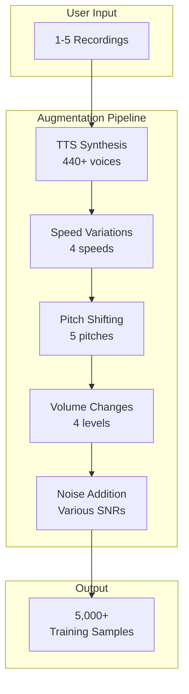
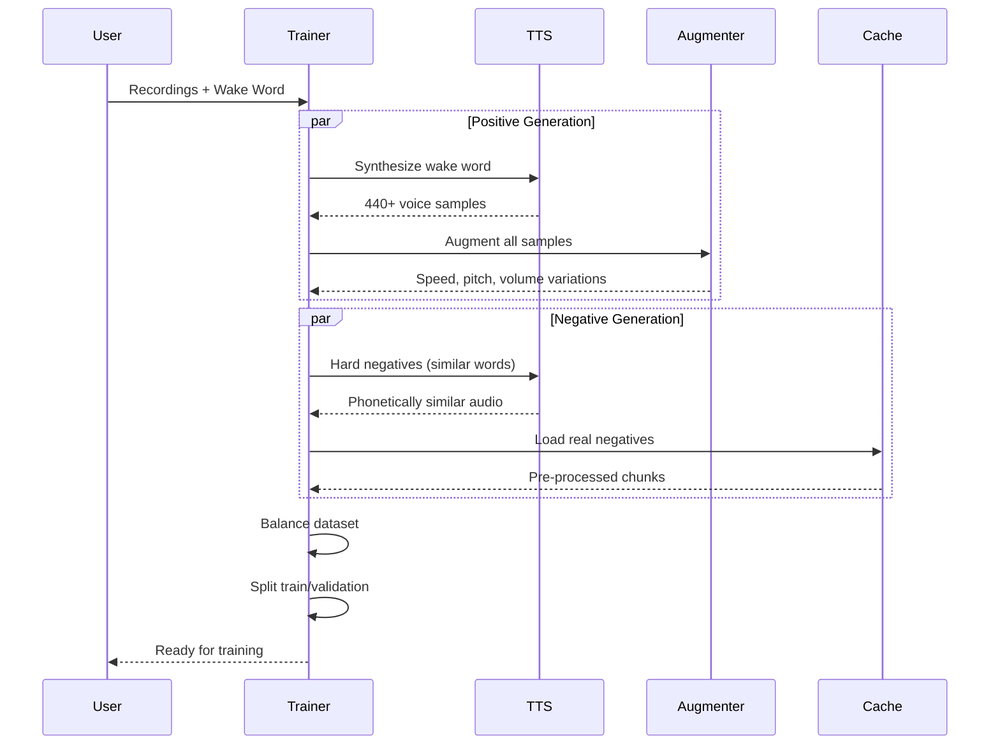

# Data Generation & Augmentation

How WakeBuilder generates diverse training data from minimal recordings.

---

## Overview

WakeBuilder transforms a few voice recordings into thousands of training samples:



---

## TTS Synthesis

### Sample Multiplication

Each wake word is synthesized across multiple TTS engines:

| Engine | Voices | × Speeds | × Volumes | Samples |
|--------|--------|----------|-----------|---------|
| Piper | ~87 | 3 | 4 | ~1,044 |
| Edge | ~302 | 2 | 4 | ~2,416 |
| Kokoro | ~40 | 2 | 4 | ~320 |
| Coqui | ~10 | 2 | 4 | ~80 |
| **Total** | | | | **~3,860** |

### Voice Diversity

TTS provides diversity in:

- **Gender**: Male and female voices
- **Accent**: American, British, Australian, Indian
- **Age**: Various perceived ages
- **Style**: Neutral, expressive, formal

---

## Audio Augmentation

### Speed Variation

| Speed | Purpose |
|-------|---------|
| 0.9x | Slower speakers |
| 1.0x | Normal speed |
| 1.1x | Faster speakers |
| 1.5x | Very fast speech |

### Pitch Shifting

| Semitones | Purpose |
|-----------|---------|
| -2 | Lower voices |
| -1 | Slightly lower |
| 0 | Original |
| +1 | Slightly higher |
| +2 | Higher voices |

### Volume Variation

| Gain (dB) | Purpose |
|-----------|---------|
| -6 dB | Quiet speech |
| -3 dB | Moderately quiet |
| 0 dB | Normal |
| +3 dB | Loud speech |

### Noise Addition

| SNR (dB) | Environment |
|----------|-------------|
| -20 dB | Very noisy |
| -10 dB | Moderately noisy |
| -5 dB | Light noise |
| 0 dB | Clean (no noise) |

---

## Negative Sample Generation

### Categories

| Type | Source | Purpose |
|------|--------|---------|
| **Hard negatives** | TTS | Similar-sounding words |
| **Real negatives** | Cache | Speech, music, ambient |
| **Noise** | Generator | Pure noise, silence |

### Hard Negatives (Critical)

Phonetically similar words prevent false positives:

```
Wake word: "jarvis"

Hard negatives generated:
- Pure prefixes: ja, jar, jarv, jarvi
- Extensions: jarvey, jarvice, jarvson
- Suffixes: arvis, rvis, vis
- Edit distance 1: javis, jarvs, jervis
- Phonetic: gervice, chervice
```

### Real Negatives (from UNAC)

Pre-processed chunks from diverse audio:

| Category | Description | Chunks |
|----------|-------------|--------|
| Music | Various genres | ~15,000 |
| Speech | Random speech | ~20,000 |
| Ambient | Environmental | ~8,000 |
| Silence | Near-silent | ~4,000 |
| **Total** | | **~47,000** |

---

## Sample Balancing

### Typical Distribution

With default settings (5,000 positives):

| Type | Count | Ratio |
|------|-------|-------|
| Positives (TTS + augmented) | 5,000 | 1.0x |
| Real negatives | 10,000 | 2.0x |
| Hard negatives | 20,000 | 4.0x |
| **Total** | **35,000** | |

### Train/Validation Split

| Set | Percentage | Purpose |
|-----|------------|---------|
| Training | 75% | Model learning |
| Validation | 25% | Performance evaluation |

Important: Validation uses **unseen TTS voices** to test generalization.

---

## Configuration

### Data Generation Settings

| Setting | Default | Range |
|---------|---------|-------|
| `target_positive_samples` | 5,000 | 3,000 - 8,000 |
| `negative_ratio` | 2.0 | 1.0 - 3.0 |
| `hard_negative_ratio` | 4.0 | 2.0 - 6.0 |
| `use_tts_positives` | true | - |
| `use_real_negatives` | true | - |
| `use_hard_negatives` | true | - |

### Augmentation Settings

| Setting | Default | Purpose |
|---------|---------|---------|
| `speed_range` | [0.9, 1.1] | Normal variations |
| `speed_fast` | [1.3, 1.5] | Fast speech |
| `pitch_range` | [-2, +2] | Semitones |
| `volume_range` | [0.7, 1.3] | Gain multiplier |
| `noise_snr_range` | [-20, -5] | dB |

---

## Processing Flow

### Training Data Preparation



---

## Reference

Source files:

- `src/wakebuilder/audio/augmentation.py` - DataAugmenter class
- `src/wakebuilder/audio/negative_generator.py` - Hard negative generation
- `src/wakebuilder/audio/real_data_loader.py` - Cache loading
- `src/wakebuilder/tts/` - TTS providers
