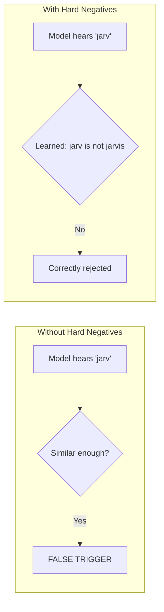
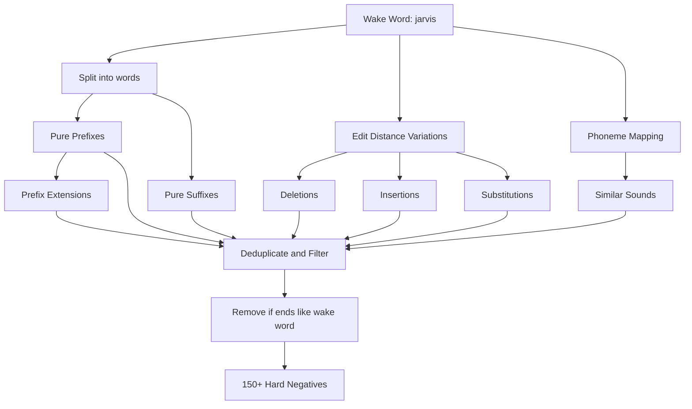

# Hard Negative Generation

Understanding how WakeBuilder generates phonetically similar words to reduce false positives.

---

## Why Hard Negatives Matter

Hard negatives are **words that sound similar to your wake word** but should NOT trigger detection. Without them, a model might:

- Trigger on partial matches ("jar" for "jarvis")
- Confuse similar-sounding words ("jarvy" for "jarvis")
- Have high false positive rates in real-world usage



---

## Generation Algorithm

WakeBuilder's hard negative generator creates phonetically similar variations organized by **priority**:

### Priority Levels

| Priority | Category | Description | Example for "jarvis" |
|----------|----------|-------------|---------------------|
| **Critical** | Pure Prefixes | Incomplete utterances | "ja", "jar", "jarv", "jarvi" |
| **High** | Prefix Extensions | Words starting with wake word | "jarvey", "jarvison" |
| **High** | Suffixes | Endings of the wake word | "arvis", "rvis", "vis" |
| **High** | Edit Distance 1 | One character different | "javis", "jarvs" |
| **Medium** | Phonetic Variations | Sound-alike patterns | "jarvy", "jervice" |
| **Medium** | Phrase Starters | Common phrase beginnings | "hey jarvis", "hi jarvis" |

### Algorithm Flow



Reference: `src/wakebuilder/audio/negative_generator.py` → `get_phonetically_similar_words()`

---

## Prefix Generation

### Pure Prefixes

Every prefix from 2 characters to n-1 characters:

```
"jarvis" → ["ja", "jar", "jarv", "jarvi"]
```

### Why Prefixes Are Critical

Partial utterances are the most common cause of false positives:

- User starts saying the wake word but stops
- Background noise cuts off the end
- Model triggers on just the beginning

### Prefix Extensions

Generate words that START with the wake word but continue:

| Original | Extension |
|----------|-----------|
| jarvi | jarvey, jarvice, jarvey |
| jar | jarman, jarred, jarson |

---

## Edit Distance Variations

### Levenshtein Distance = 1

Words that differ by exactly one character:

| Operation | Example |
|-----------|---------|
| **Deletion** | jarvis → jarvi, jarv_s |
| **Insertion** | jarvis → jarviss, jjarvis |
| **Substitution** | jarvis → jervis, jarvus |
| **Transposition** | jarvis → jarivs |

### Implementation

```python
def generate_edit_distance_1(word: str) -> list[str]:
    results = []
    alphabet = 'abcdefghijklmnopqrstuvwxyz'
    
    # Deletions
    for i in range(len(word)):
        results.append(word[:i] + word[i+1:])
    
    # Insertions
    for i in range(len(word) + 1):
        for c in alphabet:
            results.append(word[:i] + c + word[i:])
    
    # Substitutions
    for i in range(len(word)):
        for c in alphabet:
            if c != word[i]:
                results.append(word[:i] + c + word[i+1:])
    
    # Transpositions
    for i in range(len(word) - 1):
        results.append(word[:i] + word[i+1] + word[i] + word[i+2:])
    
    return results
```

---

## Phoneme-Based Variations

### Sound-Alike Mappings

Characters that sound similar:

| Original | Similar Sounds |
|----------|----------------|
| j | dz, g, ch |
| v | f, b, w |
| s | z, sh, c |
| a | ah, ay, e |
| r | l, w |
| i | ee, y, e |

### Implementation

```python
PHONEME_MAP = {
    'a': ['ah', 'ay', 'e', 'uh'],
    'e': ['ee', 'eh', 'i', 'ey'],
    'i': ['ee', 'ih', 'y', 'ey'],
    'j': ['g', 'dz', 'ch'],
    's': ['z', 'sh', 'c', 'ss'],
    'v': ['f', 'b', 'w'],
    # ... more mappings
}

def phonetic_variations(word: str) -> list[str]:
    results = []
    for i, char in enumerate(word):
        if char in PHONEME_MAP:
            for replacement in PHONEME_MAP[char]:
                results.append(word[:i] + replacement + word[i+1:])
    return results
```

---

## Ending Substitutions

### Two-Character Endings

Replace the last 2 characters with common endings:

| Original | Variations |
|----------|------------|
| jarvis | jarvic, jarvix, jarvin |
| phoenix | phoenic, phoenin, phoenim |

### Three-Character Endings

Replace the last 3 characters:

| Original | Variations |
|----------|------------|
| jarvis | jarvack, jarvice, jarving |

---

## Filtering

### Remove Invalid Negatives

Negatives are filtered to avoid overlapping with the actual wake word:

```python
def has_forbidden_ending(candidate: str, original: str) -> bool:
    last_char = original[-1]
    last_2_chars = original[-2:] if len(original) >= 2 else ""
    
    # Don't filter pure prefixes (they're critical)
    if original.startswith(candidate) and len(candidate) < len(original):
        return False
    
    # Filter if ends with same chars
    if candidate.endswith(last_char):
        return True
    if candidate.endswith(last_2_chars):
        return True
    
    return False
```

### Why This Filtering

If a negative ends with the same sound as the wake word, the model might learn to associate that ending with "not wake word," hurting detection of the actual wake word.

---

## TTS Synthesis

### Generating Audio

Each hard negative is synthesized using TTS:

```python
from wakebuilder.tts import TTSGenerator

generator = TTSGenerator()
hard_negatives = get_phonetically_similar_words("jarvis")

for word in hard_negatives:
    for voice in generator.available_voices:
        audio = generator.synthesize(word, voice)
        # Add to negative training set
```

### Sample Count

For "jarvis" with default settings:

| Category | Count | × Voices | × Speeds | Total |
|----------|-------|----------|----------|-------|
| Hard negatives | ~150 | ~10 | 3 | ~4,500 |

With `hard_negative_ratio = 4.0x`:

- Target: 4 × 5,000 positives = 20,000 hard negatives
- Actual: Generated to meet ratio target

---

## Configuration

### Training Options

| Setting | Default | Description |
|---------|---------|-------------|
| `use_hard_negatives` | `true` | Enable hard negative generation |
| `hard_negative_ratio` | `4.0` | Ratio to positive samples |

### Ratio Guidelines

| Ratio | Behavior |
|-------|----------|
| 1.0x | Minimal (fast, lower accuracy) |
| 2.0x | Basic (reasonable accuracy) |
| 4.0x | Recommended (good balance) |
| 6.0x | Maximum (best accuracy, slower) |

---

## Example Output

For wake word **"jarvis"**:

```
=== CRITICAL (Pure Prefixes) ===
ja, jar, jarv, jarvi

=== HIGH PRIORITY ===
# Prefix Extensions
jarvey, jarvy, jarvman, jarvson

# Suffixes
arvis, rvis, vis, is

# Edit Distance 1
javis, jarvs, jrvis, jarvas, jarvos

=== MEDIUM PRIORITY ===
# Phonetic Variations
gervis, dzervis, jarfis

# Phrase Starters (filtered)
# "hey jarvis" → appears in positive set, not included
```

---

## Impact on Model Quality

### Without Hard Negatives

| Metric | Value |
|--------|-------|
| Accuracy | ~85% |
| False Positive Rate | ~15% |
| Real-world usability | Poor |

### With Hard Negatives (4.0x ratio)

| Metric | Value |
|--------|-------|
| Accuracy | ~97% |
| False Positive Rate | ~2% |
| Real-world usability | Excellent |

---

## Troubleshooting

??? question "Model triggers on similar words"

    Increase `hard_negative_ratio` to 5.0x or 6.0x to generate more 
    phonetically similar training examples.

??? question "Training takes too long"

    Reduce `hard_negative_ratio` to 2.0x for faster training, but expect
    slightly lower accuracy.

??? question "Model misses wake word detection"

    If `hard_negative_ratio` is too high, reduce it. Too many negatives
    can make the model overly conservative.
