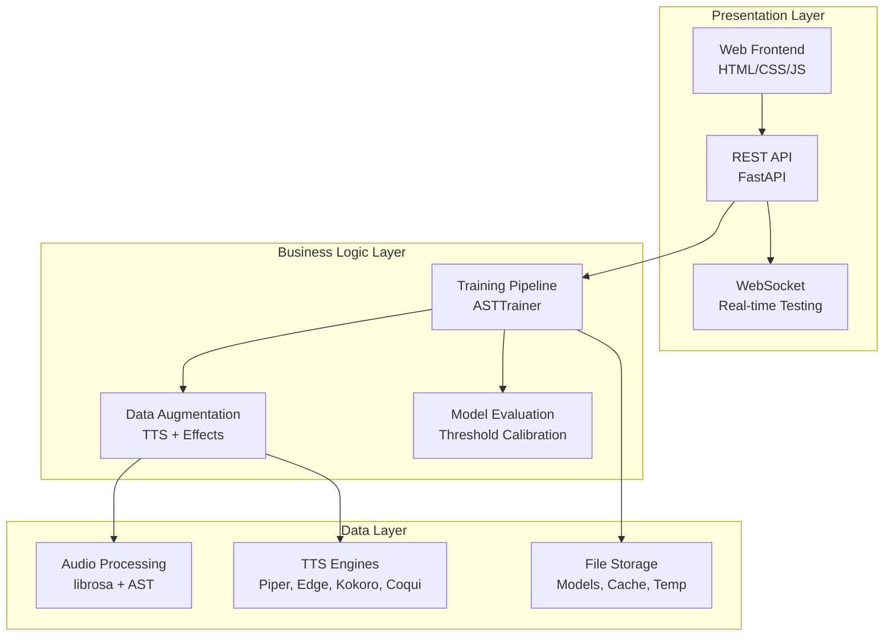

# Technical Guide

Deep dive into WakeBuilder's architecture, algorithms, and implementation details.

---

## Overview

This section provides comprehensive technical documentation for developers, contributors, and users who want to understand the inner workings of WakeBuilder.

---

## System Architecture

WakeBuilder follows a three-layer architecture:

---

## In This Section

- :material-sitemap:{ .lg .middle } **Architecture Overview**

    ---

    System design, component interactions, and data flow.

    [:octicons-arrow-right-24: Architecture](architecture.md)

- :material-waveform:{ .lg .middle } **Audio Processing**

    ---

    Preprocessing, spectrograms, and feature extraction.

    [:octicons-arrow-right-24: Audio Processing](audio-processing.md)

- :material-folder-multiple:{ .lg .middle } **Data Generation**

    ---

    TTS synthesis, augmentation, and dataset creation.

    [:octicons-arrow-right-24: Data Generation](data-generation.md)

- :material-microphone-variant:{ .lg .middle } **TTS Providers**

    ---

    Piper, Edge, Kokoro, and Coqui TTS integration.

    [:octicons-arrow-right-24: TTS Providers](tts-providers.md)

- :material-shield-alert:{ .lg .middle } **Hard Negatives**

    ---

    Phonetically similar word generation for robust models.

    [:octicons-arrow-right-24: Hard Negatives](hard-negatives.md)

- :material-brain:{ .lg .middle } **AST Model**

    ---

    Audio Spectrogram Transformer architecture and classifier.

    [:octicons-arrow-right-24: AST Model](ast-model.md)

- :material-cog-sync:{ .lg .middle } **Training Pipeline**

    ---

    Training loop, optimization, and convergence strategies.

    [:octicons-arrow-right-24: Training Pipeline](training-pipeline.md)

- :material-chart-line:{ .lg .middle } **Model Evaluation**

    ---

    Metrics, threshold calibration, and validation.

    [:octicons-arrow-right-24: Model Evaluation](model-evaluation.md)

- :material-export:{ .lg .middle } **ONNX Export**

    ---

    Model export for production deployment.

    [:octicons-arrow-right-24: ONNX Export](onnx-export.md)

---

## Key Technologies

| Component | Technology | Purpose |
|-----------|------------|---------|
| **Base Model** | Audio Spectrogram Transformer (AST) | Speech understanding |
| **Framework** | PyTorch | Neural network training |
| **Backend** | FastAPI | REST API and WebSocket |
| **Audio** | librosa | Audio processing |
| **TTS** | Piper, Edge, Kokoro, Coqui | Voice synthesis |
| **Export** | ONNX | Cross-platform deployment |

---

## Source Code Reference

| Module | Location | Purpose |
|--------|----------|---------|
| Configuration | `src/wakebuilder/config.py` | Centralized settings |
| Audio Processing | `src/wakebuilder/audio/` | Preprocessing and augmentation |
| TTS Generators | `src/wakebuilder/tts/` | Voice synthesis |
| Model Architecture | `src/wakebuilder/models/` | AST and classifier |
| Backend API | `src/wakebuilder/backend/` | FastAPI endpoints |
| Frontend | `frontend/` | Web interface |
| Scripts | `scripts/` | Utility and helper scripts |
| Tests | `tests/` | Unit and integration tests |
