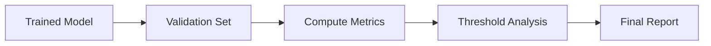
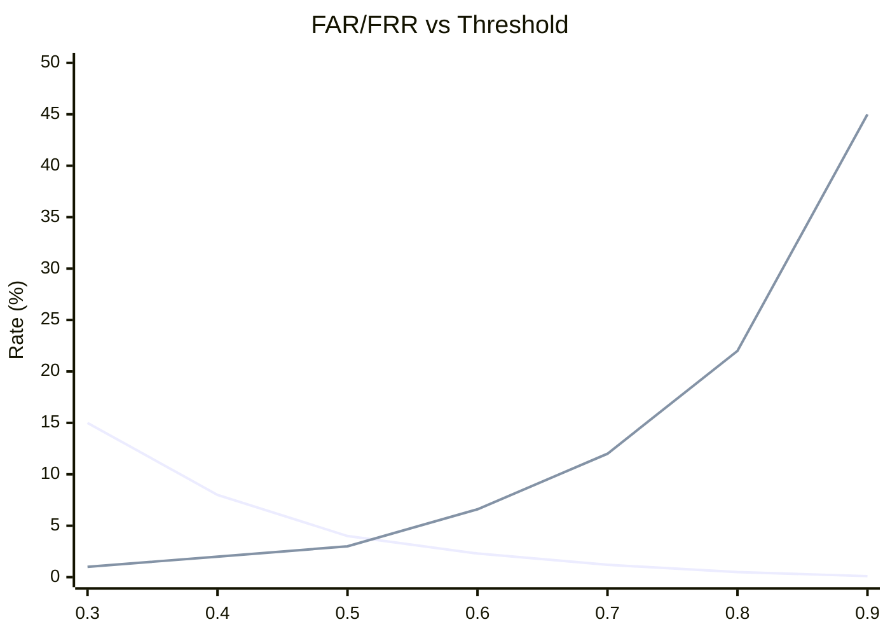

# Model Evaluation

How WakeBuilder evaluates trained wake word models.

---

## Overview

Model evaluation happens after training to assess performance:



---

## Evaluation Metrics

### Accuracy

Percentage of correct predictions:

$$\text{Accuracy} = \frac{TP + TN}{TP + TN + FP + FN}$$

| Score | Interpretation |
|-------|----------------|
| > 98% | Excellent |
| 95-98% | Very good |
| 90-95% | Good |
| < 90% | Needs improvement |

---

### Precision

How many detected wake words were correct:

$$\text{Precision} = \frac{TP}{TP + FP}$$

High precision = few false alarms.

---

### Recall (Sensitivity)

How many actual wake words were detected:

$$\text{Recall} = \frac{TP}{TP + FN}$$

High recall = few missed detections.

---

### F1 Score

Harmonic mean of precision and recall:

$$F1 = 2 \times \frac{\text{Precision} \times \text{Recall}}{\text{Precision} + \text{Recall}}$$

| Score | Interpretation |
|-------|----------------|
| > 0.95 | Excellent |
| 0.90-0.95 | Very good |
| 0.85-0.90 | Good |
| < 0.85 | Needs improvement |

---

## Error Rates

### False Acceptance Rate (FAR)

Probability of false detection:

$$FAR = \frac{FP}{TN + FP}$$

Also called False Positive Rate (FPR).

| FAR | Interpretation |
|-----|----------------|
| < 2% | Excellent |
| 2-5% | Good |
| 5-10% | Acceptable |
| > 10% | Too high |

---

### False Rejection Rate (FRR)

Probability of missed detection:

$$FRR = \frac{FN}{TP + FN}$$

Also called False Negative Rate (FNR).

| FRR | Interpretation |
|-----|----------------|
| < 5% | Excellent |
| 5-10% | Good |
| 10-15% | Acceptable |
| > 15% | Too high |

---

## Threshold Analysis

### FAR/FRR Curves

WakeBuilder computes metrics across thresholds:



- **Blue line**: FAR (decreases with higher threshold)
- **Red line**: FRR (increases with higher threshold)

### Optimal Threshold

The recommended threshold minimizes the combined error:

$$\text{Optimal} = \arg\min_{\theta} (FAR(\theta) + FRR(\theta))$$

Or prioritizes F1 score:

$$\text{Optimal} = \arg\max_{\theta} F1(\theta)$$

---

## Confusion Matrix

### Visual Breakdown

| | Predicted Positive | Predicted Negative |
|---|---|---|
| **Actual Positive** | True Positive (TP) | False Negative (FN) |
| **Actual Negative** | False Positive (FP) | True Negative (TN) |

### Example

For a typical model:

| | Detected | Not Detected |
|---|---|---|
| **Wake Word** | 1,175 (TP) | 75 (FN) |
| **Not Wake Word** | 175 (FP) | 7,325 (TN) |

---

## Validation Split

### Unseen Voice Validation

Critical: Validation uses **voices not seen during training**:

```
Training set (75%):
- TTS voices 1-400
- Augmented user recordings

Validation set (25%):
- TTS voices 401-500
- Held-out augmentations
```

This ensures the model generalizes to new speakers.

---

## Metadata Report

After evaluation, metrics are saved to the model metadata:

```json
{
  "threshold": 0.65,
  "metrics": {
    "accuracy": 0.971,
    "f1_score": 0.943,
    "precision": 0.952,
    "recall": 0.934,
    "far": 0.023,
    "frr": 0.066
  },
  "threshold_analysis": {
    "thresholds": [0.3, 0.4, 0.5, 0.6, 0.7, 0.8, 0.9],
    "far_values": [0.15, 0.08, 0.04, 0.023, 0.012, 0.005, 0.001],
    "frr_values": [0.01, 0.02, 0.03, 0.066, 0.12, 0.22, 0.45]
  },
  "confusion_matrix": {
    "tp": 1175,
    "tn": 7325,
    "fp": 175,
    "fn": 75
  }
}
```

---

## Web Interface Display

The training results page shows:

### Summary Card

| Metric | Value |
|--------|-------|
| Accuracy | 97.1% |
| F1 Score | 0.943 |
| Threshold | 0.65 |

### Threshold Chart

Interactive chart showing FAR/FRR trade-off.

### Training History

Graphs of loss and accuracy over epochs.

---

## Interpreting Results

### Good Model

| Metric | Target |
|--------|--------|
| Accuracy | > 95% |
| F1 | > 0.90 |
| FAR | < 5% |
| FRR | < 5% |

### Signs of Overfitting

- High training accuracy (>99%) but lower validation accuracy
- Large gap between train and val loss
- Model works well on TTS but poorly on your voice

### Signs of Underfitting

- Low accuracy on both training and validation
- Training loss not decreasing
- Model fails to detect wake word consistently

---

## Improving Results

### Lower FAR (Fewer False Positives)

1. Increase hard negative ratio
2. Raise detection threshold
3. Enable all model enhancements
4. Train longer

### Lower FRR (Fewer Misses)

1. Add more recordings
2. Lower detection threshold
3. Increase positive sample count
4. Check recording quality
