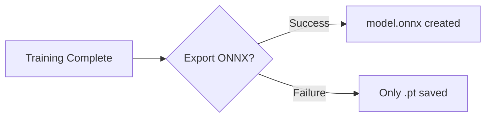
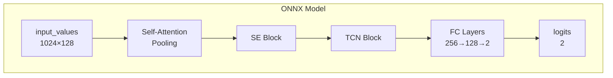

# ONNX Export

Exporting trained models to ONNX for cross-platform deployment.

---

## What is ONNX?

**ONNX (Open Neural Network Exchange)** is an open format for representing machine learning models. It enables:

- **Cross-platform deployment** - Run on Windows, Linux, macOS, mobile
- **Optimized inference** - Faster than PyTorch for production
- **Hardware acceleration** - CPU, GPU, and edge devices
- **WakeEngine compatibility** - Required for WakeEngine deployment

---

## Automatic Export

ONNX export happens automatically after successful training:



Check if ONNX export is available:

```json
{
  "has_onnx": true,
  "onnx_size_bytes": 2450000
}
```

---

## Manual Export

### Via Script

```bash
python scripts/export_onnx.py --model jarvis
```

### Via API

```bash
curl -X POST http://localhost:8000/api/models/jarvis/export-onnx
```

### Programmatic Export

```python
import torch
from wakebuilder.models.classifier import ASTWakeWordModel

# Load model
model = ASTWakeWordModel()
model.load_classifier("models/custom/jarvis/jarvis.pt")
model.eval()

# Create dummy input
dummy_input = torch.randn(1, 1024, 128)

# Export
torch.onnx.export(
    model,
    dummy_input,
    "jarvis.onnx",
    input_names=["input_values"],
    output_names=["logits"],
    dynamic_axes={"input_values": {0: "batch"}},
    opset_version=17,
)
```

---

## Model Architecture

### Input/Output Specification

| Tensor | Name | Shape | Type |
|--------|------|-------|------|
| Input | `input_values` | `[batch, 1024, 128]` | float32 |
| Output | `logits` | `[batch, 2]` | float32 |

### Processing Flow



---

## ONNX Runtime Inference

### Python

```python
import onnxruntime as ort
import numpy as np

# Load model
session = ort.InferenceSession("jarvis.onnx")

# Prepare input (from AST feature extractor)
input_values = preprocess_audio(audio)  # Shape: [1, 1024, 128]

# Run inference
outputs = session.run(
    ["logits"],
    {"input_values": input_values.astype(np.float32)}
)

# Get probability
logits = outputs[0]
probs = softmax(logits)
wake_word_prob = probs[0, 1]  # Class 1 = wake word

# Detect
detected = wake_word_prob >= threshold
```

### Preprocessing for ONNX

The ONNX model expects AST-processed features:

```python
from transformers import AutoFeatureExtractor

extractor = AutoFeatureExtractor.from_pretrained(
    "MIT/ast-finetuned-speech-commands-v2"
)

def preprocess_for_onnx(audio, sample_rate=16000):
    # Extract features
    inputs = extractor(
        audio,
        sampling_rate=sample_rate,
        return_tensors="np"
    )
    return inputs["input_values"]
```

---

## Optimization

### Quantization

Reduce model size with INT8 quantization:

```python
import onnxruntime as ort
from onnxruntime.quantization import quantize_dynamic

# Dynamic quantization
quantize_dynamic(
    "jarvis.onnx",
    "jarvis_int8.onnx",
    weight_type=QuantType.QInt8
)
```

| Model | Size | Inference Speed |
|-------|------|-----------------|
| FP32 | ~2.4 MB | Baseline |
| INT8 | ~0.6 MB | ~40% faster |

### Execution Providers

Configure hardware acceleration:

```python
# GPU (CUDA)
session = ort.InferenceSession(
    "jarvis.onnx",
    providers=["CUDAExecutionProvider", "CPUExecutionProvider"]
)

# CPU only
session = ort.InferenceSession(
    "jarvis.onnx",
    providers=["CPUExecutionProvider"]
)

# TensorRT (NVIDIA)
session = ort.InferenceSession(
    "jarvis.onnx",
    providers=["TensorrtExecutionProvider"]
)
```

---

## Validation

### Verify ONNX Model

```python
import onnx

# Load and check
model = onnx.load("jarvis.onnx")
onnx.checker.check_model(model)

# Print structure
print(onnx.helper.printable_graph(model.graph))
```

### Compare with PyTorch

```python
# PyTorch prediction
with torch.no_grad():
    pt_output = pt_model(input_tensor)

# ONNX prediction
ort_output = ort_session.run(None, {"input": input_numpy})

# Compare
assert np.allclose(pt_output.numpy(), ort_output[0], atol=1e-5)
```

---

## Troubleshooting

??? question "ONNX export fails"

    1. Check PyTorch version compatibility
    2. Try a lower opset version:
       ```python
       torch.onnx.export(..., opset_version=14)
       ```
    3. Simplify the model (remove optional components)

??? question "ONNX inference gives different results"

    1. Ensure input preprocessing is identical
    2. Check floating point precision
    3. Verify opset version compatibility

??? question "ONNX model is too large"

    1. Apply quantization (INT8)
    2. Remove unused operations
    3. Use model pruning
