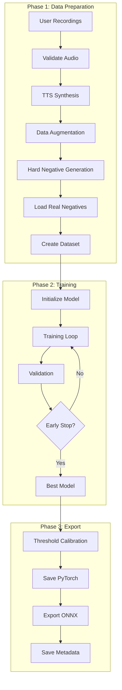
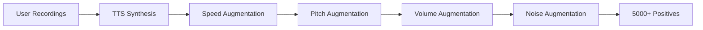
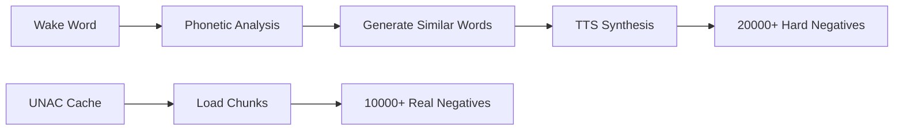

# Training Pipeline

The complete training process from data preparation to model saving.

---

## Overview



---

## Phase 1: Data Preparation

### Audio Validation

User recordings are validated:

| Check | Requirement |
|-------|-------------|
| Format | WAV, MP3, FLAC, OGG |
| Duration | 0.5 - 3.0 seconds |
| Sample rate | Convertible to 16kHz |
| Energy | Non-silent |

### Positive Sample Generation



### Negative Sample Generation



### Dataset Creation

Samples are split with unseen voice validation:

| Set | Positives | Negatives | Total |
|-----|-----------|-----------|-------|
| Train | 3,750 | 22,500 | 26,250 |
| Validation | 1,250 | 7,500 | 8,750 |
| **Total** | **5,000** | **30,000** | **35,000** |

---

## Phase 2: Training

### Model Initialization

```python
model = ASTWakeWordModel(
    freeze_base=True,  # Freeze AST
    classifier_hidden_dims=[256, 128],
    classifier_dropout=0.5,
    use_attention=True,
    use_se_block=True,
    use_tcn=True,
)
```

### Training Configuration

| Parameter | Default | Description |
|-----------|---------|-------------|
| **Optimizer** | AdamW | With weight decay |
| **Scheduler** | OneCycleLR | Warmup + cosine |
| **Loss** | FocalLoss | Hard example focus |
| **Batch size** | 32 | Per GPU |
| **Learning rate** | 0.0001 | Peak LR |
| **Weight decay** | 0.01 | Regularization |
| **Warmup** | 10% of steps | LR warmup |

### Focal Loss

Focuses on hard examples:

$$FL(p_t) = -\alpha_t (1 - p_t)^\gamma \log(p_t)$$

| Parameter | Default | Effect |
|-----------|---------|--------|
| α (alpha) | 0.5 | Class balance |
| γ (gamma) | 2.0 | Focus strength |

### Mixup Augmentation

Virtual training samples are created by mixing embeddings:

$$\tilde{x} = \lambda x_i + (1-\lambda) x_j$$
$$\tilde{y} = \lambda y_i + (1-\lambda) y_j$$

Where $\lambda \sim Beta(\alpha, \alpha)$ and $\alpha = 0.5$.

### Training Loop

```python
for epoch in range(max_epochs):
    # Training
    model.train()
    for batch in train_loader:
        embeddings = model.get_embeddings(batch.audio)
        
        # Apply mixup
        embeddings, labels = mixup(embeddings, batch.labels)
        
        # Forward pass
        logits = model.classifier(embeddings)
        loss = focal_loss(logits, labels)
        
        # Backward
        optimizer.zero_grad()
        loss.backward()
        optimizer.step()
        scheduler.step()
    
    # Validation
    val_metrics = validate(model, val_loader)
    
    # Early stopping check
    if val_metrics.loss < best_loss:
        best_loss = val_metrics.loss
        patience_counter = 0
        save_checkpoint(model)
    else:
        patience_counter += 1
        if patience_counter >= patience:
            break
```

### Early Stopping

Training stops when validation loss doesn't improve:

| Setting | Value | Effect |
|---------|-------|--------|
| Patience | 8 | Epochs without improvement |
| Min delta | 0.001 | Minimum improvement required |

---

## Phase 3: Export

### Threshold Calibration

Find optimal detection threshold:

```python
for threshold in np.arange(0.3, 0.9, 0.05):
    predictions = (probs >= threshold)
    far = false_positives / total_negatives
    frr = false_negatives / total_positives
    f1 = compute_f1(predictions, labels)
    
    if f1 > best_f1:
        best_threshold = threshold
```

### Model Saving

**PyTorch (.pt)**:

```python
torch.save({
    'classifier_state_dict': model.classifier.state_dict(),
    'config': model.classifier.config,
}, f"{wake_word}.pt")
```

**Metadata (.json)**:

```json
{
  "wake_word": "jarvis",
  "threshold": 0.65,
  "accuracy": 0.971,
  "f1_score": 0.943,
  "training_config": { ... }
}
```

**ONNX (.onnx)**:

```python
torch.onnx.export(
    model,
    dummy_input,
    f"{wake_word}.onnx",
    input_names=["input_values"],
    output_names=["logits"],
    dynamic_axes={"input_values": {0: "batch"}},
)
```

---

## Metrics

### Training Metrics

| Metric | Description |
|--------|-------------|
| **Train Loss** | Focal loss on training set |
| **Val Loss** | Focal loss on validation set |
| **Val Accuracy** | Correct predictions / total |
| **Val F1** | Harmonic mean of precision & recall |

### Final Evaluation

| Metric | Formula | Target |
|--------|---------|--------|
| **Accuracy** | (TP + TN) / Total | > 95% |
| **Precision** | TP / (TP + FP) | > 90% |
| **Recall** | TP / (TP + FN) | > 90% |
| **F1 Score** | 2 × P × R / (P + R) | > 0.90 |
| **FAR** | FP / Total Negatives | < 5% |
| **FRR** | FN / Total Positives | < 5% |

---

## Timeline

Training time varies significantly based on your hardware:

| Hardware | Approximate Total Time |
|----------|------------------------|
| High-end GPU (RTX 3080+) | 30 min - 1.5 hours |
| Mid-range GPU (RTX 3060) | 1 - 2 hours |
| Entry GPU (GTX 1650) | 2 - 4 hours |
| CPU only | **4+ hours** |

!!! warning "GPU Strongly Recommended"
    The AST model is computationally intensive. Training on CPU is not
    recommended for practical use due to extremely slow processing times.

---

## Reference

Source files:

- `src/wakebuilder/models/trainer.py` - ASTTrainer class
- `src/wakebuilder/models/classifier.py` - Model architecture
- `src/wakebuilder/backend/routes/training.py` - API integration
