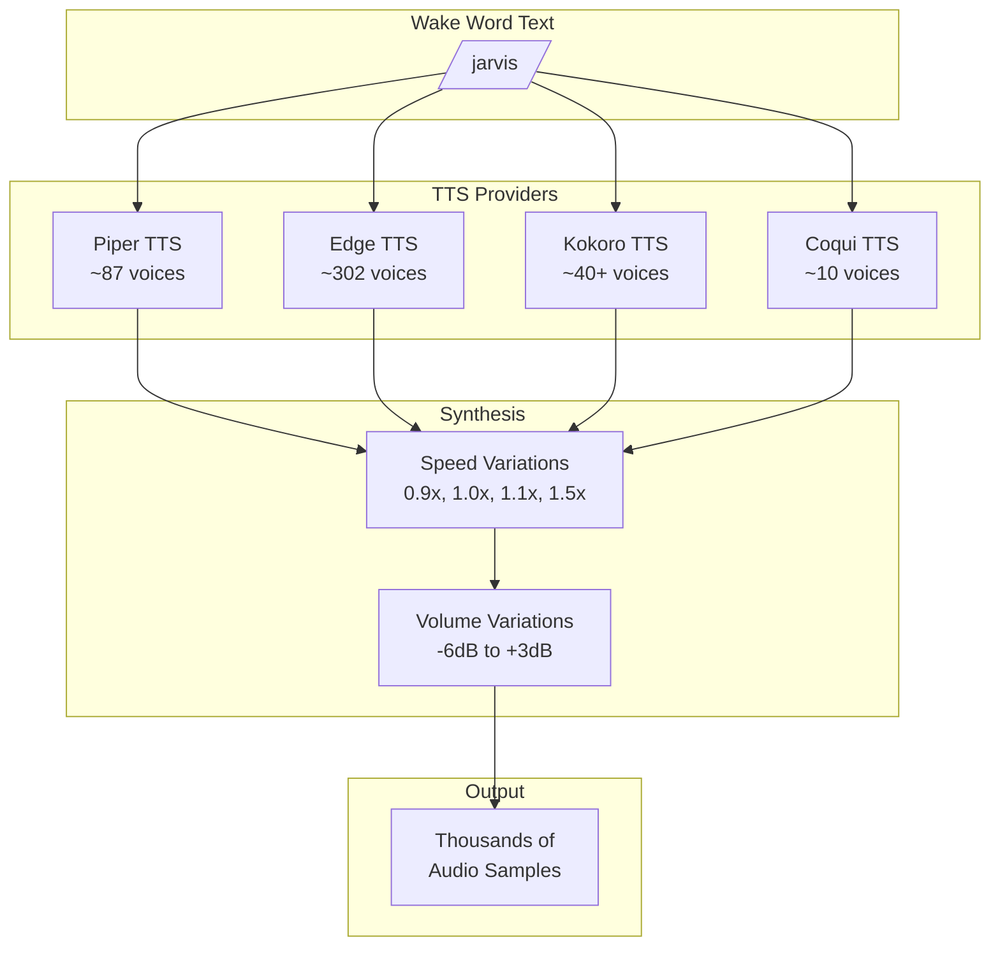
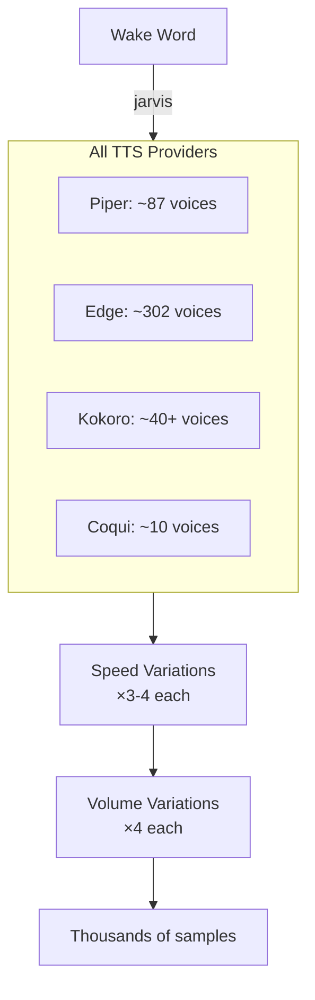

# TTS Providers

WakeBuilder uses multiple Text-to-Speech engines to generate diverse training data.

---

## Overview

TTS (Text-to-Speech) synthesis is critical for data augmentation. By generating synthetic voice samples using multiple TTS engines, WakeBuilder creates a diverse training dataset from just a few user recordings.



---

## Piper TTS

### Overview

[Piper](https://github.com/rhasspy/piper) is a fast, high-quality offline neural TTS system. It's the primary TTS engine for WakeBuilder due to its quality and local operation.

### Characteristics

| Property | Value |
|----------|-------|
| **Voices** | ~87 English voices |
| **Languages** | Multiple (English focus) |
| **Quality** | High (neural synthesis) |
| **Speed** | Fast (real-time factor ~10x) |
| **Privacy** | 100% offline |
| **Size** | ~50MB per voice |

### Voice Diversity

Piper voices include:

- **Genders**: Male and female
- **Accents**: American, British, Australian, Indian
- **Ages**: Various (young, middle-aged, elderly)
- **Styles**: Neutral, expressive, formal

### Source Reference

- **Module**: `src/wakebuilder/tts/generator.py`
- **Class**: `TTSGenerator`
- **Voice Directory**: `tts_voices/`
- **Voice List**: `scripts/piper_tts_voices.json`

### Usage Example

```python
from wakebuilder.tts import TTSGenerator

generator = TTSGenerator()
audio, sample_rate = generator.synthesize(
    text="jarvis",
    voice_name="en_US-amy",
    length_scale=1.0  # Speed: <1.0 faster, >1.0 slower
)
```

---

## Edge TTS

### Overview

[Edge TTS](https://github.com/rany2/edge-tts) provides access to Microsoft's neural TTS voices used in Edge browser. It offers exceptional quality and a large voice selection.

### Characteristics

| Property | Value |
|----------|-------|
| **Voices** | ~302 across many languages |
| **Languages** | 100+ (comprehensive) |
| **Quality** | Excellent (Microsoft Neural) |
| **Speed** | Fast (network-dependent) |
| **Privacy** | Audio sent to Microsoft |
| **Size** | No local models needed |

!!! note "Internet Required"
    Edge TTS requires an internet connection as synthesis happens on Microsoft's servers.

### Voice Categories

| Category | Examples |
|----------|----------|
| **US English** | JennyNeural, AriaNeural, GuyNeural |
| **UK English** | SoniaNeural, RyanNeural |
| **Australian** | NatashaNeural, WilliamNeural |
| **Indian** | NeerjaNeural, PrabhatNeural |
| **European** | German, French, Spanish, Italian |

### Source Reference

- **Module**: `src/wakebuilder/tts/edge_generator.py`
- **Class**: `EdgeTTSGenerator`
- **Voice List**: `scripts/list of voices available in Edge TTS.txt`

### Usage Example

```python
from wakebuilder.tts.edge_generator import EdgeTTSGenerator

generator = EdgeTTSGenerator()
audio, sample_rate = generator.synthesize(
    text="jarvis",
    voice="en-US-JennyNeural",
    speed=1.0  # Speed multiplier
)
```

### Speed Variations

Edge TTS uses rate strings:

| Speed | Rate String |
|-------|-------------|
| 1.0x | `+0%` |
| 1.25x | `+25%` |
| 1.5x | `+50%` |
| 0.75x | `-25%` |

---

## Kokoro TTS

### Overview

[Kokoro](https://github.com/hexgrad/kokoro) is a high-quality neural TTS model with 40+ English voices. It provides excellent quality with both American and British accents.

### Characteristics

| Property | Value |
|----------|-------|
| **Voices** | ~40+ English voices |
| **Languages** | English (American & British) |
| **Quality** | Excellent (neural) |
| **Speed** | Moderate (GPU recommended) |
| **Privacy** | 100% offline |
| **Size** | ~82MB model |

### Voice Categories

| Accent | Description |
|--------|-------------|
| **American** | Various male and female voices |
| **British** | Various male and female voices |

### Voice ID Examples

| Voice ID | Name | Gender | Accent |
|----------|------|--------|--------|
| `af_heart` | Heart | Female | American |
| `af_bella` | Bella | Female | American |
| `am_michael` | Michael | Male | American |
| `bf_emma` | Emma | Female | British |
| `bm_george` | George | Male | British |

### Source Reference

- **Module**: `src/wakebuilder/tts/kokoro_generator.py`
- **Class**: `KokoroTTSGenerator`
- **Constants**: `KOKORO_VOICES` dictionary

### Usage Example

```python
from wakebuilder.tts.kokoro_generator import KokoroTTSGenerator

generator = KokoroTTSGenerator(use_gpu=True)
audio, sample_rate = generator.synthesize(
    text="jarvis",
    voice_id="af_heart",
    speed=1.0
)
```

---

## Coqui TTS

### Overview

[Coqui TTS](https://github.com/coqui-ai/TTS) provides high-quality VITS-based synthesis with support for multiple speakers.

### Characteristics

| Property | Value |
|----------|-------|
| **Voices** | ~10 speakers (VCTK subset) |
| **Languages** | Multiple (English focus) |
| **Quality** | Very good (VITS) |
| **Speed** | Moderate (GPU recommended) |
| **Privacy** | 100% offline |
| **Size** | ~100MB per model |

### Available Models

| Model Key | Description | Speakers |
|-----------|-------------|----------|
| `vctk` | English VITS | ~10 |
| `your_tts` | Multi-lingual | ~6 |

### Source Reference

- **Module**: `src/wakebuilder/tts/coqui_generator.py`
- **Class**: `CoquiTTSGenerator`
- **Model Config**: `COQUI_MODELS` dictionary

### Usage Example

```python
from wakebuilder.tts.coqui_generator import CoquiTTSGenerator

generator = CoquiTTSGenerator(use_gpu=True)
audio, sample_rate = generator.synthesize(
    text="jarvis",
    model_key="vctk",
    speaker="p225"  # Speaker ID
)
```

---

## Unified TTS Interface

### Combined Generation

The training pipeline uses all available TTS providers:

```python
# In data augmentation
tts_samples = []

# Piper TTS (primary)
piper_gen = TTSGenerator()
for voice in piper_gen.available_voices:
    audio = piper_gen.synthesize(wake_word, voice)
    tts_samples.append(audio)

# Edge TTS (secondary)
edge_gen = EdgeTTSGenerator()
for voice in edge_gen.voice_ids:
    audio = edge_gen.synthesize(wake_word, voice)
    tts_samples.append(audio)

# Kokoro TTS (tertiary)
kokoro_gen = KokoroTTSGenerator()
for voice in kokoro_gen.voice_ids:
    audio = kokoro_gen.synthesize(wake_word, voice)
    tts_samples.append(audio)
```

### Sample Generation Flow



---

## Configuration

### TTS Settings in config.py

```python
# Speed variations applied to TTS output
SPEED_VARIATIONS = [0.9, 1.0, 1.1, 1.5]

# Volume variations in dB
VOLUME_VARIATIONS = [-6, -3, 0, 3]

# Target sample rate (resample TTS output)
TARGET_SAMPLE_RATE = 16000
```

### Enabling/Disabling Providers

In the web interface, use the training options:

- **Generate TTS Positives**: Enable/disable TTS synthesis
- TTS engines are used based on availability

---

## Downloading Voice Models

### Piper Voices

Use the download script:

```bash
python scripts/download_voices.py
```

This downloads:

- All English Piper voice models
- Configuration files
- Total: ~5GB

### Other TTS Dependencies

Edge, Kokoro, and Coqui models are downloaded on first use.

---

## Comparison Table

| Feature | Piper | Edge | Kokoro | Coqui |
|---------|-------|------|--------|-------|
| **Voices** | ~87 | ~302 | ~40+ | ~10 |
| **Quality** | High | Excellent | Excellent | Very Good |
| **Speed** | Fast | Fast | Moderate | Moderate |
| **Offline** | ✓ | ✗ | ✓ | ✓ |
| **GPU Benefit** | - | - | High | High |
| **Languages** | Many | 100+ | English | Many |
| **Disk Space** | ~5GB | 0 | ~82MB | ~100MB |

---

## Troubleshooting

??? question "Edge TTS not working"

    Edge TTS requires internet connectivity. Check your network connection.

??? question "Kokoro/Coqui very slow"

    These models benefit significantly from GPU acceleration. Ensure CUDA is 
    properly configured.

??? question "Missing Piper voices"

    Run `python scripts/download_voices.py` to download all voice models.

??? question "Out of memory during TTS"

    TTS generators cache loaded models. Call `generator.cleanup()` or 
    `generator.clear_cache()` to free memory.
