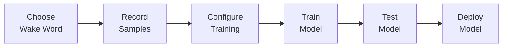

# User Guide

Welcome to the WakeBuilder User Guide! This section covers everything you need to know to create, train, test, and manage your custom wake word models.

---

## Overview

WakeBuilder provides a complete workflow for creating wake word detection models:

---

## In This Section

- :material-microphone:{ .lg .middle } **Creating Your First Model**

    ---

    Step-by-step guide to creating a new wake word model from scratch.

    [:octicons-arrow-right-24: Create Model](first-model.md)

- :material-cog-play:{ .lg .middle } **Training Workflow**

    ---

    Understanding the complete training process and what happens at each stage.

    [:octicons-arrow-right-24: Training Workflow](training-workflow.md)

- :material-test-tube:{ .lg .middle } **Testing Models**

    ---

    How to test your trained models with live audio and file uploads.

    [:octicons-arrow-right-24: Test Models](testing-models.md)

- :material-folder-cog:{ .lg .middle } **Model Management**

    ---

    Managing, downloading, and organizing your trained wake word models.

    [:octicons-arrow-right-24: Manage Models](model-management.md)

- :material-monitor:{ .lg .middle } **Web Interface Guide**

    ---

    Complete walkthrough of the WakeBuilder web interface.

    [:octicons-arrow-right-24: Web Interface](web-interface.md)

- :material-star:{ .lg .middle } **Tips for Best Results**

    ---

    Expert tips and best practices for creating high-quality wake word models.

    [:octicons-arrow-right-24: Best Practices](best-practices.md)

---

## Quick Reference

### Recommended Settings

For most users, the default settings work well:

| Setting | Default | Notes |
|---------|---------|-------|
| **Recordings** | 3-5 | More recordings improve accuracy |
| **Target Positives** | 5,000 | Balanced training set |
| **Negative Ratio** | 2.0x | Good discrimination |
| **Hard Negative Ratio** | 4.0x | Critical for accuracy |
| **Batch Size** | 32 | Works for most hardware |
| **Max Epochs** | 100 | Early stopping handles termination |
| **Learning Rate** | 0.0001 | Stable training |

### Typical Training Times

Training is a computationally intensive process. Expect it to take time:

| Hardware | Expected Time |
|----------|---------------|
| High-end GPU (RTX 3080+) | 30 min - 1.5 hours |
| Mid-range GPU (RTX 3060) | 1 - 2 hours |
| Entry GPU (GTX 1650) | 2 - 4 hours |
| CPU only | **4+ hours** (not recommended) |

!!! warning "GPU Strongly Recommended"
    Training on CPU is extremely slow due to the complexity of the AST model
    and data augmentation pipeline.

---

## Getting Help

If you encounter issues:

1. Check the [Troubleshooting](../deployment/local-development.md#troubleshooting) section
2. Review [Best Practices](best-practices.md) for optimization tips
3. Open an issue on [GitHub](https://github.com/XableTech/WakeBuilder/issues)
