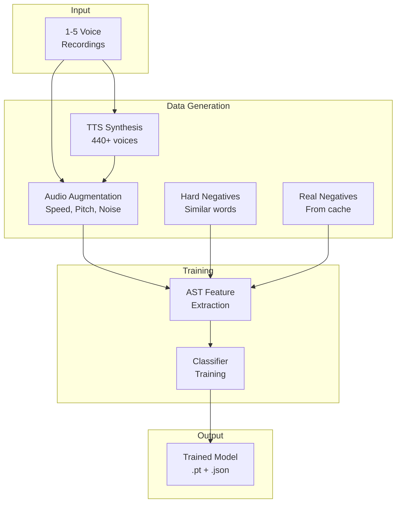

# Training Workflow

Understanding what happens during wake word model training.

---

## Overview

WakeBuilder's training pipeline transforms a few voice recordings into a robust wake word detection model through several sophisticated stages:



---

## Phase 1: Data Preparation

### User Recording Processing

Your voice recordings are processed:

1. **Format conversion**: Converted to 16kHz mono WAV
2. **Duration validation**: Checked for 0.5-3.0 second range
3. **Normalization**: Audio levels normalized
4. **Storage**: Saved to temporary directory

Reference: `src/wakebuilder/backend/routes/training.py` → `validate_audio_file()`

---

## Phase 2: Positive Sample Generation

### TTS Synthesis

WakeBuilder generates synthetic voice samples using multiple TTS engines:

| TTS Provider | Voices | Characteristics |
|--------------|--------|-----------------|
| **Piper TTS** | ~87 | High-quality offline neural voices |
| **Edge TTS** | ~302 | Microsoft's cloud neural voices |
| **Kokoro TTS** | ~40+ | American & British accents |
| **Coqui TTS** | ~10 | Multi-speaker VITS models |

Reference: `src/wakebuilder/tts/` directory

### Voice Diversity

Each TTS provider generates variations with:

- **Speed variations**: 0.9x, 1.0x, 1.1x, 1.5x
- **Volume variations**: -6dB, -3dB, 0dB, +3dB
- **Gender mix**: Male and female voices
- **Accent variety**: American, British, European

### Audio Augmentation

Each sample is further augmented:

| Augmentation | Values | Purpose |
|--------------|--------|---------|
| **Speed stretch** | 0.8x-1.2x | Simulate speaking rates |
| **Pitch shift** | -2 to +2 semitones | Voice pitch variation |
| **Volume** | 0.7x-1.3x | Recording level variation |
| **Background noise** | -20dB to -5dB SNR | Environmental noise |
| **Time shift** | -0.1s to +0.1s | Timing variation |

Reference: `src/wakebuilder/audio/augmentation.py`

### Sample Count

From just 3 recordings, WakeBuilder generates:

```
User recordings:        3
× TTS voices:        ~440
× Speed variations:     3
× Volume variations:    4
--------------------------------
Target positives:  5,000+
```

---

## Phase 3: Negative Sample Generation

Negative samples teach the model what **not** to trigger on.

### Hard Negatives (Critical)

Phonetically similar words are generated automatically:

For wake word **"jarvis"**, WakeBuilder generates:

| Category | Examples |
|----------|----------|
| **Pure prefixes** | "ja", "jar", "jarv", "jaa" |
| **Prefix extensions** | "jarvey", "jarvy", "jarman" |
| **Suffixes** | "arvis", "rvis", "vis" |
| **Edit distance 1** | "javis", "jarvs", "jarviss" |
| **Phonetic variations** | "hey jarvis", "hi jarvis" |

Reference: `src/wakebuilder/audio/negative_generator.py` → `get_phonetically_similar_words()`

### Real Negatives

From the negative data cache (UNAC dataset):

- Random speech that doesn't contain the wake word
- Music, ambient sounds, silence
- Pre-chunked into 1-second segments
- ~47,000 cached chunks available

Reference: `src/wakebuilder/audio/real_data_loader.py`

### Negative Ratio

The balance of negatives to positives:

| Type | Default Ratio | Purpose |
|------|---------------|---------|
| **Hard negatives** | 4.0x | Prevent similar-word triggers |
| **Real negatives** | 2.0x | General speech discrimination |

---

## Phase 4: Data Splitting

Training data is split for validation:

| Set | Percentage | Purpose |
|-----|------------|---------|
| **Training** | 75% | Model learning |
| **Validation** | 25% | Performance evaluation |

!!! important "Voice Separation"
    Validation uses **unseen TTS voices** to test generalization.
    Approximately 34 voices are held out specifically for validation.

---

## Phase 5: Feature Extraction

### AST Feature Extractor

Each audio sample is processed through the Audio Spectrogram Transformer:

```
Audio (16kHz, 1s)
      ↓
Mel Spectrogram (128 × 1024)
      ↓
AST Encoder (87M parameters, frozen)
      ↓
768-dimensional Embedding
```

Reference: `src/wakebuilder/models/classifier.py` → `ASTWakeWordModel`

### Why AST?

The **MIT/ast-finetuned-speech-commands-v2** model:

- Pre-trained on Speech Commands dataset (35 words)
- Understands speech patterns across diverse speakers
- Provides rich audio representations
- Enables few-shot learning

---

## Phase 6: Classifier Training

### Model Architecture

The trainable classifier head:

```
768-dim Embedding
      ↓
LayerNorm
      ↓
Self-Attention (optional, 4 heads)
      ↓
SE Block (optional, squeeze-excitation)
      ↓
TCN Block (optional, temporal convolutions)
      ↓
Linear(768 → 256) + BatchNorm + GELU + Dropout
      ↓
Linear(256 → 128) + BatchNorm + GELU + Dropout
      ↓
Linear(128 → 2)
      ↓
Softmax → [wake_word_prob, not_wake_word_prob]
```

Reference: `src/wakebuilder/models/classifier.py` → `WakeWordClassifier`

### Training Configuration

| Parameter | Default | Description |
|-----------|---------|-------------|
| **Optimizer** | AdamW | Weight decay regularization |
| **Scheduler** | OneCycleLR | Warmup + cosine annealing |
| **Loss** | Focal Loss | Hard example focus |
| **Batch size** | 32 | Samples per gradient update |
| **Learning rate** | 0.0001 | Base learning rate |
| **Dropout** | 0.5 | Regularization strength |
| **Label smoothing** | 0.1 | Confidence calibration |
| **Mixup alpha** | 0.5 | Data augmentation |

Reference: `src/wakebuilder/models/trainer.py` → `TrainingConfig`

### Loss Function

**Focal Loss** focuses training on hard examples:

$$\text{FL}(p_t) = -\alpha_t (1 - p_t)^\gamma \log(p_t)$$

Where:

- $\alpha$ = class weight (default 0.5)
- $\gamma$ = focusing parameter (default 2.0)
- Higher $\gamma$ → more focus on hard examples

Reference: `src/wakebuilder/models/trainer.py` → `FocalLoss`

### Early Stopping

Training stops when:

- Validation loss doesn't improve for N epochs (patience)
- Maximum epochs reached
- Target metrics achieved

---

## Phase 7: Model Evaluation

### Threshold Calibration

WakeBuilder finds the optimal detection threshold:

1. Run validation set through trained model
2. Compute FAR/FRR at thresholds from 0.3 to 0.9
3. Select threshold with best F1 score
4. Store in model metadata

### Metrics Computed

| Metric | Formula | Target |
|--------|---------|--------|
| **Accuracy** | (TP + TN) / Total | >95% |
| **Precision** | TP / (TP + FP) | >90% |
| **Recall** | TP / (TP + FN) | >90% |
| **F1 Score** | 2 × (P × R) / (P + R) | >0.90 |
| **FAR** | FP / Total Negatives | <5% |
| **FRR** | FN / Total Positives | <5% |

Reference: `src/wakebuilder/models/trainer.py` → `ASTTrainer.validate()`

---

## Phase 8: Model Export

### PyTorch Model

Saved as `.pt` file containing:

- Classifier weights
- Model configuration
- Feature extractor reference

### ONNX Export

Converted to `.onnx` for deployment:

- Platform-independent format
- Optimized for inference
- Compatible with WakeEngine

### Metadata JSON

Stored alongside the model:

```json
{
  "wake_word": "jarvis",
  "model_type": "ast",
  "created_at": "2026-01-06T15:00:00Z",
  "threshold": 0.65,
  "accuracy": 0.971,
  "f1_score": 0.943,
  "trainable_params": 234567,
  "training_config": { ... }
}
```

Reference: `src/wakebuilder/models/classifier.py` → `save_wake_word_model()`

---

## Training Timeline

Training time varies significantly based on your hardware:

| Hardware | Approximate Total Time |
|----------|------------------------|
| High-end GPU (RTX 3080+) | 30 min - 1.5 hours |
| Mid-range GPU (RTX 3060) | 1 - 2 hours |
| Entry GPU (GTX 1650) | 2 - 4 hours |
| CPU only | **4+ hours** |

### Typical Phases

| Phase | Description |
|-------|-------------|
| TTS Generation | Synthesizing voices (depends on GPU) |
| Hard Negatives | Creating similar-word samples |
| Cache Loading | Loading negative audio chunks |
| Training Loop | Main training epochs |
| Evaluation | Threshold calibration |
| Export | ONNX model generation |

!!! warning "CPU Training is Slow"
    Training on CPU is **not recommended** for practical use. The AST model
    is computationally intensive and requires GPU acceleration for
    reasonable training times.
